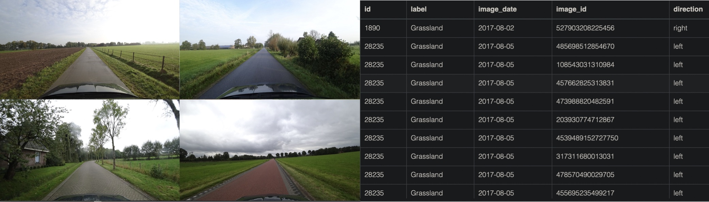
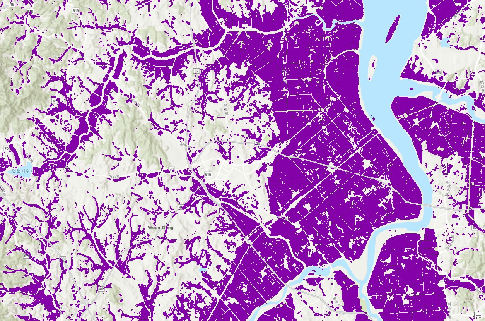
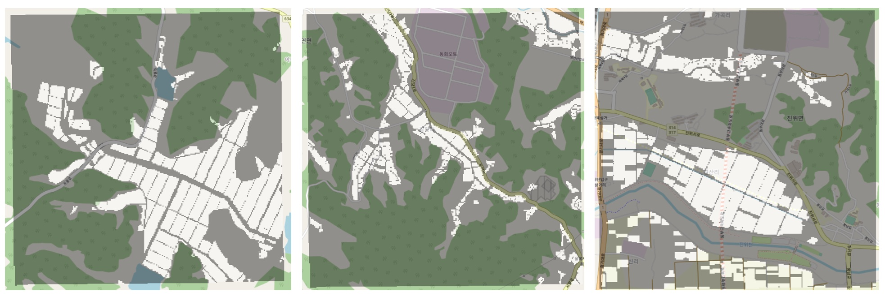

# AI for Copernicus - a data repository by [CALLISTO](http://www.callisto-h2020.eu/)
A list of datasets aiming to enable Artificial Intelligence applications that use Copernicus data. 

<!-- ### Table of contents
* [Callisto Generated Datasets](#callisto_generated)
    1. [Annotated street-level images from Mapillary](#annotated_street_level_mapillary)
    2. [Paddy Rice Maps South Korea (2017~2021)](#paddy_rice_south_korea_2017_2021)
    3. [Paddy Rice Labeling Sites in South Korea (2018)](#paddy_rice_labelling_south_korea_2018)
* [Existing Datasets](#existing)
    1. [Analysis Ready Sentinel Data ](#analysis_ready_sentinel)
        1. [EarthNet2021 dataset](#earthnet_2021)
        2. [BigEarthNet dataset](#bigearthnet_2021)
        3. [So2Sat](#so2sat)
        4. [EuroSAT dataset](#eurosat)
        5. [Sen12MS](#sen12ms)
        6. [SAT-4](#sat4)
        7. [SAT-6](#sat6)
    2. [Crop Classification Datasets](#crop_classification_datasets)
        1. [ZueriCrop](#zuericrop)
        2. [CV4A_Kenya](#cv4a_kenya)
        3. [TimeSen2Crop](#timesen2crop)
        4. [Sen4AgriNet](#sen4agrinet)
        5. [BreizhCrops](#breizhcrops)
        6. [Crop Type Mapping - Semantic Segmentation Datasets in Ghana](#crop_type_mapping_semantic_segmentation_ghana)
        7. [CaneSat](#canesat)
        8. [Spot the Crop Challenge](#spot_the_crop_challenge)
        9. [Denethor](#denethor)
    3. [Ancillary Crop Related Annotated Datasets](#ancillary_crop_related_annotated)
        1. [Crop Deep](#crop_deep)
        2. [PlantVillage - Healthy and unhealthy leaf images](#plant_village)
        3. [iCrop - Street-level Imagery for Crop Classification](#icrop)
    4. [Other Annotated Datasets](#other_annotated)
        1. [Sen1Floods11](#sen1floods11)
        2. [Labeled SAR imagery dataset of ten geophysical phenomena from Sentinel-1 wave mode (TenGeoP-SARwv)](#labelled_sar_geophysical)
        3. [Hand-labelled Crop/No-Crop dataset](#hand_labelled_crop_no-crop)
        4. [Open VHR images and geospatial data (Netherlands)](#open_vhr_images_and_geospatial_netherlands)
            - [Land Parcel Identification Systems (LPIS)](#lpis_netherlands)
            - [Reference Parcels](#reference_parcels_netherlands)
            - [Orthoimages (Web Service)](#orthoimages_netherlands)
            - [Lidar data (Current Altitude Data)](#lidar_data_netherlands)
            - [Soil Data (physical characteristics)](#soil_data_physical_netherlands)
            - [VHR Satellite Data](#vhr_satellite_netherlands)
        5. [Land Cover Map (Korean Ministry of Environment)](#land_cover_map_korea_environment)
        6. [Farm Map (Korean Ministry of Agriculture, Food and Rural Affairs)](#farm_map_korea_agriculture)
    5. [Web Application / Websites with labelled data](#web_application_websites_labelled_data)
        1. [Mapillary Street Level Images](#mapillary_web)
        2. [Eden Library](#eden_library)
    6. [UAV/Aerial Imagery](#uav_aerial_imagery)
        1. [Open Aerial Map - UAV Imagery](#open_aerial_map_uav)
        2. [VisDrone dataset](#visdrone)
        3. [Agriculture-Vision: Challenges & Opportunities for Computer Vision in Agriculture](#agriculture_vision_challenges_opportunities)
        4. [AU-AIR Dataset](#auair)
        5. [UAV-based Multispectral & Thermal dataset for exploring the diurnal variability & geometric accuracy for precision agriculture](#uav_diurnal_variability)
        6. [senseFly Datasets](#sensefly)
        7. [A Crop/Weed Field Image Dataset (CWFID)](#crop_weed_field_image)
        8. [LandCover.ai](#landcoverai)
    7. [Crop phenology annotated datasets](#crop_phenology_annotated)
        1. [DWD_RECENT](#dwd_recent)
        2. [DWD_ARCHIVE](#dwd_archive)
        3. [PEP725](#pep725)
    8. [European Projects](#eu_projects)
        1. [NextGEOSS Data Catalog (DaaS)](#nextgeoss_daas)
        2. [Geocradle Data Catalog (Daas)](#geocradle_daas)
        3. [Copernicus](#copernicus_all)
            - [COPERNICUS ATMOSPHERE MONITORING SERVICE (CAMS)](#copernicus_cams)
            - [COPERNICUS CLIMATE CHANGE SERVICE (C3S)](#copernicus_c3s)
            - [COPERNICUS LAND MONITORING SERVICE (CLMS)](#copernicus_clms)
            - [COPERNICUS MARINE ENVIRONMENT MONITORING SERVICE (CMEMS)](#copernicus_cmems)
            - [COPERNICUS OPEN ACCESS HUB](#copernicus_open_access_hub)
* [Other Useful Data Collections](#other_useful_collections)
    1. [Randiant MLHub](#radiant_mlhub)
    2. [Awesome-Remote-Sensing-Dataset](#awesome_remote_sensing_dataset)
    3. [awesome-remote-sensing](#awesome_remote_sensing_2)
    4. [Awesome Remote Sensing Change Detection](#awesome_sensing_detection)
    5. [Remote sensing resources](#remote_sensing_resources)
 -->

## Callisto Generated Datasets 

- [Annotated Street Level Images from Mapillary (published in MMM22)](https://github.com/Agri-Hub/Mapillary_Annotation)   
Crop type labels from the freely available Land Parcel Identification System (LPIS) of the Netherlands are matched with all available Mapillary street-level images for the year 2017.  
  
    |  Data Source  | Type  |  Area  |            Task           | Paper |   Code   | Relevant implementations |
    | :------------:|:-----:|:------:| :------------------------:|:-----:|:--------:|:------------------------:|
    | Street level images  | Image | Netherlands | Crop Classification | [(2022)](https://zenodo.org/record/5845512#.YfEqq_uxVH4) | [GitHub](https://github.com/Agri-Hub/Callisto/tree/main/Mapillary) | [Street2Sat](https://github.com/nasaharvest/street2sat_website/tree/ICML_paper_code), [DenseASPP](https://github.com/DeepMotionAIResearch/DenseASPP), [Crop Phenology](https://github.com/Momut1/flevoland), [Scene Segmentation](https://github.com/mapillary/seamseg) |

- [Paddy Rice Maps South Korea (2017~2021)](https://zenodo.org/record/5845896)   
 This dataset includes paddy rice maps in South Korea from 2017 to 2021 with 10m resolution. The paddy rice maps are a product of deep learning model predictions and DO NOT represent ground truth information. The predictions were made by analyzing time series Sentinel-1 images based on the deep learning architecture that integrates U-Net and RNNs layers desined by eGIS/RS lab, Korea University. The deep learning model has been trained with 7,762 patches and validated in 5,180 patches for each patch consists of 256 x 256 pixels, and can be found in h5 format [here](https://zenodo.org/record/6345555#.YirIKXNByUl). The labels were acquired from the farm map produced by the Korean Ministry of Agriculture, Food and Rural Affairs(MAFRA). Moreover, the authors have made public a [pre-trained model](https://916e49e3-4865-4754-af5f-be19c7f09272.filesusr.com/archives/0832c0_1bf3cd5028344b6189c18d9af0329dad.zip?dn=recurrent_unet.zip). The validation accuracy and Cohen's kappa value are 96.50%, 0.7857 each which were calculated from the 40% of the farm map. For more information please contact to the KU-eGIS/RS lab.  
  
    |  Data Source  | Type  |  Area  |            Task           | Paper |   Code   |
    | :------------:|:-----:|:------:| :------------------------:|:-----:|:--------:|
    | Sentinel 2| GeoTIFF | South Korea | Paddy Rice Mapping | - | [GitHub](https://github.com/Hyun-Woo-Jo/Paddy_Rice_Maps-South_Korea-2017_2021) |

    
- [Paddy Rice Labeling Sites in South Korea (2018)](https://zenodo.org/record/5846018)   
  The paddy rice was visually interpreted at 30 sites in South Korea. The sites were selected at each province by a proportional stratified sampling method according to the paddy rice area statistics (Statistics Korea), so the dataset can be used for the validation on model generalization over the entire country. The paddy rice areas were visually interpreted by using Google Earth Pro and street view services (https://map.naver.com, https://map.kakao.com) and updated to the state of 2018.   
 
    |  Data Source  | Type  |  Area  |            Task           | Paper |   Code   |
    | :------------:|:-----:|:------:| :------------------------:|:-----:|:--------:|
    | Sentinel 2| GeoTIFF | South Korea | Paddy Rice Validation | - | - |

## Existing Datasets 

### Agriculture 
#### Analysis Ready Remote Sensing Data with labels 

- [CropHarvest: a global satellite dataset for crop type classification](https://zenodo.org/record/5533193#.YgI9u_ixWUk)   
  The CropHarvest dataset is a crop dataset of geo-referenced labels with satellite data inputs, each consisting of latitude, longitude, the associated agricultural label, and a satellite pixel time series. It contains 90,480 datapoints from 20 datasets; some datasets come from existing public sources while some (e.g., Rwanda) are being made public with this publication. The datasets include 3 different types of labels: i) binary labels (crop/non crop) ii) FAO’s indicative crop classification labels, whcih resulted to 9 crop type groupings: cereals, vegetables and melons, fruits and nuts, oilseed crops, root/tuber crops, beverage and spice crops, leguminous crops, sugar crops, and other crops iii) crop-type labels, if available.  
These labels are also accomompanied by Remote sensing data. More specifically, for each point/polygon in the dataset there is also 12-timestep signature of:
  - Sentinel-2 monthly aggregated values (all bands except B1 and B10 + NDVI)
  - Sentinel-1 monthly aggregated values (VV and VH)
  - Meteorological monthly aggragated data (total precipitation and ground temperature at 2 m height from the [ERA5 dataset](https://developers.google.com/earth-engine/datasets/catalog/ECMWF_ERA5_MONTHLY) with a spatial analysis of 31 km/px)
  - Topographic Data from the [Shuttle Radar Topography Mission (SRTM) Digital Elevation Model (DEM)](https://developers.google.com/earth-engine/datasets/catalog/USGS_SRTMGL1_003) with 30m/px Shuttle Radar Topography Mission (SRTM) Digital Elevation Model (DEM) analysis.

    |  Data Source  | Type  |  Area  |            Task           | Paper |   Code   |
    | :------------:|:-----:|:------:| :------------------------:|:-----:|:--------:|
    |   Sentinel 1-2/ERA5/DEM  | Pixel | Global | Crop Classification | [(2021)](https://openreview.net/forum?id=JtjzUXPEaCu) |  [GitHub](https://github.com/nasaharvest/cropharvest) |

- [BigEarthNet dataset](http://bigearth.net/#downloads) 
  - BigEarthNet is a benchmark archive, consisting of 590,326 pairs of Sentinel-1 and Sentinel-2 image patches.
  - To construct BigEarthNet with Sentinel-2 image patches (called as BigEarthNet-S2 now, previously BigEarthNet), 125 Sentinel-2 tiles acquired between June 2017 and May 2018 over the 10 countries (Austria, Belgium, Finland, Ireland, Kosovo, Lithuania, Luxembourg, Portugal, Serbia, Switzerland) of Europe were initially selected. All the tiles were atmospherically corrected by the Sentinel-2 Level 2A product generation and formatting tool (sen2cor). Then, they were divided into 590,326 non-overlapping image patches. Each image patch was annotated by the multiple land-cover classes (i.e., multi-labels) that were provided from the CORINE Land Cover database of the year 2018 (CLC 2018). The labels in BigEarthNet belong to the initial release of the labels in 2018. 
  - To construct BigEarthNet with Sentinel-1 image patches (called as BigEarthNet-S1), 321 Sentinel-1 scenes acquired between June 2017 and May 2018 that jointly cover the area of all original 125 Sentinel-2 tiles with close temporal proximity were selected and processed. BigEarthNet-S1 consists of 590,326 preprocessed Sentinel-1 image patches - one for each Sentinel-2 patch. A more detailed explanation on the processing is given in its dataset description document.
   
    |  Data Source  | Type  |  Area  |            Task           | Paper |   Code   | Relevant Datasets |
    | :------------:|:-----:|:------:| :------------------------:|:-----:|:--------:|:-----------------:|
    | Sentinel 1/2  | Patch | Europe | Land Cover Classification | [(2019)](http://bigearth.net/static/documents/BigEarthNet_IGARSS_2019.pdf) [(2021)](https://arxiv.org/abs/2105.07921)  | [GitHub](https://git.tu-berlin.de/rsim) | [Belgium LPIS/GSAA](https://www.geopunt.be/catalogus/datasetfolder/47c5540f-bf7c-45fc-9a74-8e60547cde82) [Luxembours LPIS](https://data.public.lu/fr/datasets/referentiel-des-parcelles-flik/)
  
- [EuroSAT dataset](https://github.com/phelber/EuroSAT)   
  27000 labeled and geo-referenced Sentinel 2 satellite image patches (i.e., 64  64 pixels). Although the classification scheme is made up of 10 different classes, including land covers having peculiar temporal patterns (i.e., annual crops, permanent crops), the dataset is based on single time images.   

    |  Data Source  | Type  |  Area  |            Task           | Paper |   Code   | Relevant implementations |
    | :------------:|:-----:|:------:| :------------------------:|:-----:|:--------:|:--------:|
    |   Sentinel 2  | Patch | Europe | Land Cover Classification | [(2018)](https://ieeexplore.ieee.org/document/8519248) [(2019)](https://ieeexplore.ieee.org/abstract/document/8736785/?casa_token=Q4mLYViYwfgAAAAA:h7ZpTvlI4S_nwFLkh4E-SPpm4Acv6Ez1vQE3bCqmxNjYhZzCcKRo5aFetH_KqT4GFH2xkw9RvA)|  [GitHub](https://github.com/phelber/EuroSAT) | [EfficientNet](https://paperswithcode.com/paper/efficientnet-rethinking-model-scaling-for) [EfficientNetV2](https://paperswithcode.com/paper/efficientnetv2-smaller-models-and-faster) [Vision Transformers](https://paperswithcode.com/paper/an-image-is-worth-16x16-words-transformers-1) | 

- [Sen12MS](https://mediatum.ub.tum.de/1474000)   
  The SEN12MS dataset contains 180,662 patch triplets of corresponding Sentinel-1 dual-pol SAR data, Sentinel-2 multi-spectral images, and MODIS-derived land cover maps. The patches are distributed across the land masses of the Earth and spread over all four meteorological seasons. This is reflected by the dataset structure. All patches are provided in the form of 16-bit GeoTiffs containing the following specific information:
  - Sentinel-1 SAR: 2 channels corresponding to sigma nought backscatter values in dB scale for VV and VH polarization.
  - Sentinel-2 Multi-Spectral: 13 channels corresponding to the 13 spectral bands (B1, B2, B3, B4, B5, B6, B7, B8, B8a, B9, B10, B11, B12).
  - MODIS Land Cover: 4 channels corresponding to IGBP, LCCS Land Cover, LCCS Land Use, and LCCS Surface Hydrology layers.  
 
    |  Data Source  | Type  |  Area  |            Task           | Paper |   Code   | Relevant Implementations |
    | :------------:|:-----:|:------:| :------------------------:|:-----:|:--------:|:------------------------|
    | Sentinel 1/2  | Patch | Global | Land Cover Classification | [(2019)](https://arxiv.org/pdf/1906.07789.pdf) [(2021)](https://arxiv.org/abs/2104.00704) |  [GitHub](https://github.com/schmitt-muc/SEN12MS) | Image Classification: [EfficientNet](https://paperswithcode.com/paper/efficientnet-rethinking-model-scaling-for) [Transformer](https://github.com/tunz/transformer-pytorch/tree/e7266679f0b32fd99135ea617213f986ceede056)  [Vision Transformers](https://paperswithcode.com/paper/an-image-is-worth-16x16-words-transformers-1)   Semantic Segmentation: [U-Net](https://github.com/milesial/Pytorch-UNet/tree/67bf11b4db4c5f2891bd7e8e7f58bcde8ee2d2db) [DeepLab](https://github.com/tensorflow/models/tree/master/research/deeplab) [Transformer](https://github.com/tunz/transformer-pytorch/tree/e7266679f0b32fd99135ea617213f986ceede056) |

- [SAT-4](https://www.kaggle.com/crawford/deepsat-sat4) and [SAT-6](https://www.kaggle.com/crawford/deepsat-sat6)  
  **SAT-4**: Originally, images were extracted from the National Agriculture Imagery Program (NAIP) dataset. The SAT-4 contains 500,000 RGB images. Each sample image is 28x28 pixels (1m spatial resolution) and consists of 4 bands - red, green, blue and near infrared. Each image is annotated with one of the four classes that represent four broad land covers which include barren land, trees, grassland and a class that consists of all land cover classes other than the above three.  
  **SAT-6**: Originally, images were extracted from the National Agriculture Imagery Program (NAIP) dataset. The SAT-6 contains 405,000 RGB images. Each sample image is 28x28 pixels (1m spatial resolution) and consists of 4 bands - red, green, blue and near infrared. Each image is annotated with one of the six classes that represent six broad land covers which include barren land, trees, grassland, roads, buildings and water bodies.  
  
  This dataset could potentially be used for Super-Resolution tasks. For example, by matching this dataset with corresponing Sentinel-2 images. In the table below, we propose indicatively a list of implementations for this task on the PROBA-V dataset available on the paperwithcode website.
    |  Data Source  | Type  |  Area  |            Task           | Paper |   Code   | Relevant Implementations |
    | :------------:|:-----:|:------:| :------------------------:|:-----:|:--------:|:------------------------:|
    | Aerial (R,G,B,NIR)  | Patch | California | Land Cover Classification | [(2015)](https://dl.acm.org/doi/pdf/10.1145/2820783.2820816) | - | [Super-Resolution](https://paperswithcode.com/dataset/proba-v) |

- [ZueriCrop](https://polybox.ethz.ch/index.php/s/uXfdr2AcXE3QNB6)    
The ZueriCrop dataset contains ground truth labels of 116,000 field instances. Each field instance consists of a polygon representing the borders of the field, and its dominant crop label in 2019. The ground truth labels of all 48 crop classes are provided by the Swiss Federal Office for Agriculture (FOAG) and correspond to the primary crop grown per field during the year. The input data is a time series of 71 multi-spectral Sentinel-2 Level-2A bottom-of-atmosphere reflectance images with a ground sampling distance (GSD) of 10 meters. All input images are atmospherically corrected using the Sen2Cor v2.8 software package. The dataset is collected over a 50 km × 48 km area in the Swiss Cantons of Zurich and Thurgau between January 2019 and December 2019. The entire scene is subdivided into smaller patches of 24 px×24 px. Patches without any ground-truth information are discarded. In the remaining patches the fraction of pixels without reference label is ≈48%. Only those four spectral channels available at the highest, 10 m resolution (Red, Green, Blue, and Near-Infrared) are used. 
    |  Data Source  | Type  |  Area  |            Task           | Paper |   Code   | Relevant Implementations |
    | :------------:|:-----:|:------:| :------------------------:|:-----:|:--------:|:-------------------------:|
    |  Sentinel 2  | Patch | Zurich (Switzerland) | Crop Classification | [(2021)](https://arxiv.org/pdf/2102.08820.pdf)| [GitHub](https://github.com/0zgur0/ms-convSTAR) | [U-TAE](https://github.com/VSainteuf/utae-paps) |

- [PASTIS](https://github.com/VSainteuf/pastis-benchmark)    
  PASTIS is a benchmark dataset for panoptic and semantic segmentation of agricultural parcels from satellite time series. It contains 2,433 patches within the French metropolitan territory with panoptic annotations (instance index + semantic label for each pixel). Each patch is a Sentinel-2 multispectral image time series of variable length.  
  PASTIS dataset has been extended from the initial publication with aligned radar Sentinel-1 observations for all 2,433 patches in addition to the Sentinel-2 images. For each patch, approximately 70 observations of Sentinel-1 have been added in ascending orbit, and 70 observations in descending orbit. PASTIS-R can be used to evaluate optical-radar fusion methods for parcel-based classification, semantic segmentation, and panoptic segmentation.
  
    |  Data Source  | Type  |  Area  |            Task           | Paper |   Code   |
    | :------------:|:-----:|:------:| :------------------------:|:-----:|:--------:|
    |  Sentinel 2  | Pixel | France | Semantic and Panoptic Crop Segmentation | [(2021)](https://openaccess.thecvf.com/content/ICCV2021/papers/Garnot_Panoptic_Segmentation_of_Satellite_Image_Time_Series_With_Convolutional_Temporal_ICCV_2021_paper.pdf) [(2022)](https://www.sciencedirect.com/science/article/abs/pii/S0924271622000855)| [GitHub](https://github.com/VSainteuf/utae-paps) |
   
- [CV4A Kenya](https://mlhub.earth/10.34911/rdnt.dw605x)    
  This dataset was produced as part of the Crop Type Detection competition at the Computer Vision for Agriculture (CV4A) Workshop at the ICLR 2020 conference. The ground reference data were collected by the PlantVillage team, and Radiant Earth Foundation curated the training dataset after inspecting and selecting more than 4,000 fields from the original ground reference data. The dataset has been split into training and test sets (3,286 in the train and 1,402 in the test).
The dataset is cataloged in four tiles. These tiles are smaller than the original Sentinel-2 tile that has been clipped and chipped to the geographical area that labels have been collected. Each tile has a) 13 multi-band observations throughout the growing season. Each observation includes 12 bands from Sentinel-2 L2A product, and a cloud probability layer. The twelve bands are [B01, B02, B03, B04, B05, B06, B07, B08, B8A, B09, B11, B12]. The cloud probability layer is a product of the Sentinel-2 atmospheric correction algorithm (Sen2Cor) and provides an estimated cloud probability (0-100%) per pixel. All of the bands are mapped to a common 10 m spatial resolution grid.; b) A raster layer indicating the crop ID for the fields in the training set; and c) A raster layer indicating field IDs for the fields (both training and test sets). Fields with a crop ID of 0 are the test fields.
    |  Data Source  | Type  |  Area  |            Task           | Paper |   Code   |
    | :------------:|:-----:|:------:| :------------------------:|:-----:|:--------:|
    |  Sentinel 2  | Sentinel tiles (Images) | Kenya | Crop Classification | [(2020)](https://arxiv.org/abs/2004.03023)| [GitHub](https://github.com/sentinel-hub/cv4a-iclr-2020-starter-notebooks) |
        
- [TimeSen2Crop](https://drive.google.com/drive/folders/19YzUp0KhRnQN3IlU72vhJhCnzNJgFpsb)    
  A pixel based dataset made up of more than 1 million samples of Sentinel 2 Time Series (TSs) associated to 16 crop types. This dataset includes atmospherically corrected images and reports the snow, shadows and clouds information per labeled unit. The provided TSs represent an agronomic year ranging from September 2017 to August 2018, using the publicly available Austrian crop type map based on farmer's declarations. TimeSen2Crop also includes a TS of Sentinel 2 images acquired in the following agronomic year (i.e., from September 2018 to August 2019).
  
    |  Data Source  | Type  |  Area  |            Task           | Paper |   Code   |
    | :------------:|:-----:|:------:| :------------------------:|:-----:|:--------:|
    |  Sentinel 2  | Pixel | Austria | Crop Classification | [(2020)](https://ieeexplore.ieee.org/abstract/document/9408357)| - |
        
- [Sen4AgriNet](https://www.sen4agrinet.space.noa.gr/)    
  The Sen4AgriNet dataset is built using Sentinel-2 images from different timestamps include all spectral bands that have different spatial resolution.
  On top of the dataset, it has been developed a series of functions such as spatio-temporal aggregations, to transform the original dataset according to the different AI problems.
  - 5-year multitemporal Sentinel-2 patches 
  - Sentinel-1/2 data
  - The initial version of Sen4AgriNet consists of approximately 225,000. Corregistered with open LPIS data for regions in Spain and France with a total size of 10TB
  
    |  Data Source  | Type  |  Area  |            Task           | Paper |   Code   |
    | :------------:|:-----:|:------:| :------------------------:|:-----:|:--------:|
    |  Sentinel 2  | Patch | Europe | Crop Classification | [(2021)](https://ieeexplore.ieee.org/document/9553603)| [GitHub](https://github.com/dimzog/S4A) |
        
- [BreizhCrops](https://breizhcrops.org/)   
  BreizhCrops is a novel benchmark dataset for the supervised classification of field crops from satellite time series. It contains
aggregated label data and Sentinel-2 top-of-atmosphere as well as bottom-of-atmosphere time series in the region of Brittany (Breizh
in local language), north-east France. 
    |  Data Source  | Type  |  Area  |            Task           | Paper |   Code   |
    | :------------:|:-----:|:------:| :------------------------:|:-----:|:--------:|
    |  Sentinel 2  | Object | Brittany (France) | Crop Classification | [(2020)](https://arxiv.org/pdf/1905.11893.pdf)| [GitHub](https://github.com/dl4sits/breizhcrops) |
        
- Crop Type Mapping - Semantic Segmentation Datasets in [Ghana](http://registry.mlhub.earth/10.34911/rdnt.ry138p/) and [South Sudan](http://registry.mlhub.earth/10.34911/rdnt.v6kx6n/)    
  The datasets include time series of satellite imagery from Sentinel-1, Sentinel-2, and PlanetScope satellites throughout 2016 and 2017. For each tile/chip in the dataset, there are time series of imagery from each of the satellites, as well as a corresponding label that defines the crop type at each pixel. The label has only one value at each pixel location, and assumes that the crop type remains the same across the full time span of the satellite image time series. In many cases where ground truth was not available, pixels have no label and are set to a value of 0.
    |  Data Source  | Type  |  Area  |            Task           | Paper |   Code   |
    | :------------:|:-----:|:------:| :------------------------:|:-----:|:--------:|
    |  Sentinel 1/2 & Planetscope | GeoTIFF | Ghanna & South Sudan | Crop Classification | [(2019)](https://openaccess.thecvf.com/content_CVPRW_2019/papers/cv4gc/Rustowicz_Semantic_Segmentation_of_Crop_Type_in_Africa_A_Novel_Dataset_CVPRW_2019_paper.pdf)| [GitHub](https://github.com/roserustowicz/crop-type-mapping) |
  
  
- [CaneSat dataset](https://ieee-dataport.org/documents/canesat)    
  This dataset contains 1627 multispectral high resolution image patches of size 10 x 10 pixels with each pixel size of 10mx10m. These patches are generated from the Sentinel-2 (A/B) satellite images acquired during the period of October 2018 to May 2019. It covered one life cycle (12 months) of the sugarcane crop in the region of the Karnataka, India. Along with sugarcane crop field areas, other land covers are also included for classification purpose. The dataset provides two formats: jpg and tif. Former format includes images with RGB channels and later format includes six bands namely, Red, Green, Blue, Near Infrared, Red Edge and Short-wave infrared. Dataset also provides 3 vegetation indices .tif images such as enhanced vegetation index (EVI), normalized difference vegetation index (NDVI) and green normalized difference vegetation index (GNDVI) separately. All tif image patches are georeferenced and labeled. The focus of this dataset is to support further research in sugarcane crop classification especially in India.
    |  Data Source  | Type  |  Area  |            Task           | Paper |   Code   |
    | :------------:|:-----:|:------:| :------------------------:|:-----:|:--------:|
    |  Sentinel 1/2 | GeoTIFF, JPG | Karnataka, India | Sugarcane Classification | [(2020)](https://www.sciencedirect.com/science/article/pii/S1319157820304602)|-|
    
- [Spot the Crop Challenge](https://mlhub.earth/10.34911/rdnt.j0co8q)    
  The dataset contains a time-series of satellite imagery and labels for crop type that have been collected through aerial and ground survey. Labels are derived from the survey conducted by the Western Cape Department of Agriculture, for the period of 04-01-2017 to 11-31-2017 and the area of Western Cape, South Africa. Satellite data including multispectral Sentinel-2 are then matched with corresponding labels. The S2 time-series is provided every 5 days. Sentinel-1 data include VV and VH backscatter with a time window of 12 days. The label chips contain the mapping of pixel to crop type label. The following pixel values correspond to the following crop types.
  - 0 - No Data
  - 1 - Lucerne/Medics
  - 2 - Planted pastures (perennial)
  - 3 - Fallow
  - 4 - Wine grapes
  - 5 - Weeds
  - 6 - Small grain grazing
  - 7 - Wheat
  - 8 - Canola
  - 9 - Rooibos
    |  Data Source  | Type  |  Area  |            Task           | Paper |   Code   |
    | :------------:|:-----:|:------:| :------------------------:|:-----:|:--------:|
    |  Sentinel 1/2 | GeoTIFF | South Africa | Crop Classification |-|[GitHub](https://github.com/radiantearth/mlhub-tutorials/blob/main/notebooks/South%20Africa%20Crop%20Types%20Competition/Radiant_Earth_Spot_the_Crop_Baseline_Model.ipynb)|
     
- [DENETHOR dataset (password: dailycrops)](https://syncandshare.lrz.de/getlink/fiXFZXGbGcd9SxWTVnNv5qrx/)    
 DENETHOR: The DynamicEarthNET dataset for Harmonized, inter-Operabel, analysis-Ready, daily crop monitoring from space. Our dataset contains daily, analysis-ready Planet Fusion data together with Sentinel-1 radar and Sentinel-2 optical time-series for crop type classification in Northern Germany. The dataset includes: i) The Planet Fusion Monitoring product, which consists of clean (i.e. free from clouds and shadows), daily gap-filled, high resolution (3m), temporally consistent, radiometrically robust, harmonized and sensor agnostic surface reflectance time series, featuring and synergizing inputs from both public and private sensor sources and directly interoperable with HLS (harmonized Landsat Sentinel) surface reflectance products. ii) Sentinel-1 (S1) imagery, which contains 3 channels in total: [VV, VH, ANGLE] where V and H stand for vertical and horizontal orientations, respectively, and ANGLE stores the angle of observation to the earth surface as described here. The data is collected in Interferometric Wide (IW) swath mode and it includes both ascending and descending orbit directions. and iii) Sentinel-2 (S2) imagery, which includes all L2A bands in the following order [B01, B02, B03, B04, B05, B06, B07, B08, B8A, B09, B11, B12]. The bands that have original spatial resolution of 20m and 60m are interpolated with a nearest-neighbour method to a 10m resolution. 
    |  Data Source  | Type  |  Area  |            Task           | Paper |   Code   |
    | :------------:|:-----:|:------:| :------------------------:|:-----:|:--------:|
    |  Sentinel 1/2 & Planet Fusion| Patch | Northern Germany | Crop Classification |[(2021)](https://openreview.net/forum?id=uUa4jNMLjrL)|[GitHub](https://github.com/lukaskondmann/DENETHOR)|

- [Agriculture-Vision: Challenges & Opportunities for Computer Vision in Agriculture](https://www.agriculture-vision.com/agriculture-vision-2020/dataset)   
   The dataset contains 21,061 aerial farmland images captured throughout 2019 across the US. Each image consists of four 512x512 color channels, which are RGB and Near Infra-red (NIR). Each image also has a boundary map and a mask. The boundary map indicates the region of the farmland, and the mask indicates valid pixels in the image. Regions outside of either the boundary map or the mask are not evaluated. This dataset contains six types of annotations: Cloud shadow, Double plant, Planter skip, Standing Water, Waterway and Weed cluster. These types of field anomalies have great impacts on the potential yield of farmlands, therefore it is extremely important to accurately locate them. In the Agriculture-Vision dataset, these six patterns are stored separately as binary masks due to potential overlaps between patterns. Users are free to decide how to use these annotations. 
    |  Data Source  | Type  |  Area  |            Task           | Paper |   Code   |
    | :------------:|:-----:|:------:| :------------------------:|:-----:|:--------:|
    | Aerial | Images (RGB + NIR) | USA | Scene Classification |[(2020)](https://openaccess.thecvf.com/content_CVPR_2020/html/Chiu_Agriculture-Vision_A_Large_Aerial_Image_Database_for_Agricultural_Pattern_Analysis_CVPR_2020_paper.html)|[GitHub](https://github.com/SHI-Labs/Agriculture-Vision)|

- [UAV-based Multispectral & Thermal dataset for exploring the diurnal variability, radiometric & geometric accuracy for precision agriculture](https://dataverse.harvard.edu/dataset.xhtml?persistentId=doi:10.7910/DVN/RYA2ZQ)   
To explore the diurnal variations, radiometric and geometric accuracy of UAV-based data for precision agriculture, a comprehensive dataset was created in a one-day field campaign (21 June 2017). The multi-sensor data set covers wheat, barley & potato experimental fields, located in Wageningen University and Research (WUR) farm maintained by Unifarm. UAV-based images were collected with several sensors over the experimental area, starting from 7:25am and ending at 20:00pm local solar time. The dataset consists of images collected by 9 flights with senseFly MSP4C, 9 with Parrot Sequoia, 2 with Slant Range P3, 5 with DJI Zenmuse X3 NIR, 4 with the senseFly Thermo-map and 1 with the RGB Sony WX-220. Additionally, validation measurements at radiometric calibration plates and plant sample locations were taken with a Cropscan handheld spectrometer and a tec5 Handyspec spectrometer. The dataset consists of the validation measurements, the raw images and the processed orthomosaics (both with and without geometric correction).  
    |  Data Source  | Type  |  Area  |            Task           | Paper |   Code   |
    | :------------:|:-----:|:------:| :------------------------:|:-----:|:--------:|
    | UAV | Images (Green, Blue, Red, Red Edge, NIR, Thermal Infrared) | Wageningen, Netherlands | Crop Classification |[(2020)](https://www.researchgate.net/profile/Ramin-Heidarian-Dehkordi/publication/340853010_UAV-based_Multispectral_Thermal_dataset_for_exploring_the_diurnal_variability_radiometric_geometric_accuracy_for_precision_agriculture/links/5f4bc8cda6fdcc14c5e9763c/UAV-based-Multispectral-Thermal-dataset-for-exploring-the-diurnal-variability-radiometric-geometric-accuracy-for-precision-agriculture.pdf)|-|

#### Analysis Ready Remote Sensing Data without labels 
- [Open Aerial Map - UAV Imagery](https://map.openaerialmap.org/#/-18.6328125,18.562947442888312,3?_k=ir0sq6)   
  OpenAerialMap (OAM) is a set of tools for searching, sharing, and using openly licensed satellite and unmanned aerial vehicle (UAV) imagery.
      |  Data Source  | Type  |  Area  |            Task           | Paper |   Code   |
    | :------------:|:-----:|:------:| :------------------------:|:-----:|:--------:|
    | UAV/Aircraft/Satellite | Images | Global | Multiple (e.g. Object Detection, Scene Classification) |-|[GitHub](https://github.com/hotosm/OpenAerialMap)|
 
 - [Open VHR images and geospatial data (Netherlands)](https://nationaalgeoregister.nl/)   
  The National Georegister focuses primarily on the professional user. This can be a Geo- ICT specialist looking for datasets, services or other geo-information elements. But also a policy officer who wants to consult a map, a web developer or a student who develops a website or application and is looking for geo-information for it. Some example of available Datasets are:  
    - [Orthoimages (Web service)](https://www.nationaalgeoregister.nl/geonetwork/srv/eng/catalog.search#/map?facet.q=keyword%2Flandelijke%2520voorziening%2520beeldmateriaal&resultType=details&sortBy=relevance&any=Luchtfoto&fast=index&_content_type=json&from=1&to=50)  
    - [Lidar data (Current Altitude Data)](https://www.nationaalgeoregister.nl/geonetwork/srv/eng/catalog.search#/metadata/41daef8b-155e-4608-b49c-c87ea45d931c)  
    - [Soil Data (physical characteristics)](https://www.wur.nl/nl/show/Bodemfysische-Eenhedenkaart-BOFEK2020.htm)  
    - [VHR Satellite Data](https://satellietdataportaal.nl/) Note: It is only accessible from within The Netherlands.  
  
#### In-situ & Ground-level datasets 

- [PlantVillage Dataset - Healthy and Unhealthy leaf images](https://data.mendeley.com/datasets/tywbtsjrjv/1)   
  In this data-set, 39 different classes of plant leaf and background images are available.  The data-set containing 61,486 images. The authors used six different augmentation techniques for increasing the data-set size. The techniques are image flipping, Gamma correction, noise injection, PCA color augmentation, rotation, and Scaling.    
    |  Data Source  | Type  |  Area  |            Task           | Paper |   Code   |
    | :------------:|:-----:|:------:| :------------------------:|:-----:|:--------:|
    | Crowdsource | Grayscale/RGB Images | USA | Image Classification (healthy/unhealthy leaves) |[(2015)](https://arxiv.org/abs/1511.08060)|[GitHub](https://github.com/spMohanty/PlantVillage-Dataset)|

- [iCrop Dataset - Street-level Imagery for Crop Classification](http://www.nwatch.top:8085/icrop/)   
  It is the first large, public, multiclass road view crop photo dataset, for the development of crop type detection with deep learning.
    |  Data Source  | Type  |  Area  |            Task           | Paper |   Code   |
    | :------------:|:-----:|:------:| :------------------------:|:-----:|:--------:|
    | Streel-level | RGB Images | China | Crop Classification |[(2021)](https://www.mdpi.com/1424-8220/21/4/1165)|-|

- [A Crop/Weed Field Image Dataset (CWFID)](https://github.com/cwfid/dataset/releases) 
This dataset comprises field images, vegetation segmentation masks and crop/weed plant type annotations. The paper provides details, e.g. on the field setting, acquisition conditions, image and ground truth data format.
    |  Data Source  | Type  |  Area  |            Task           | Paper |   Code   |
    | :------------:|:-----:|:------:| :------------------------:|:-----:|:--------:|
    | Field robot | RGB Images | Northern Germany | Crop / Weed Discrimination |[(2015)](https://link.springer.com/chapter/10.1007/978-3-319-16220-1_8)|[Github](https://github.com/cwfid/dataset)|
    
#### Geo-referenced labels 
- [Hand Labelled Crop/No-Crop dataset](https://zenodo.org/record/4680394#.YM85pm6EZpQ)   
  This dataset provides the hand-labelled crop / non-crop points used for training, which were created by labelling high-resolution satellite imagery in QGIS and Google Earth Pro. Data is available for Ethiopia, Sudan, Togo and Kenya.
    |  Data Source  | Type  |  Area  |            Task           | Paper |   Code   |
    | :------------:|:-----:|:------:| :------------------------:|:-----:|:--------:|
    | Photo-interpretation | Shapefiles | Africa | Crop Discrimination |[(2021)](https://openaccess.thecvf.com/content/CVPR2021W/EarthVision/html/Tseng_Learning_To_Predict_Crop_Type_From_Heterogeneous_Sparse_Labels_Using_CVPRW_2021_paper.html)|[Github](https://github.com/nasaharvest/crop-maml)|

- [LEM+ dataset](https://data.mendeley.com/datasets/vz6d7tw87f/1)   
  The dataset, in ESRI shapefile format (spatial reference system: WGS 84, EPSG: 4326), provides monthly land use information about 1854 fields from October 2019 to September 2020 from Luís Eduardo Magalhães (LEM) and other municipalities in the west of Bahia state, Brazil. The majority of the 16 land uses classes are related to crops. 
  
    |  Data Source  | Type  |  Area  |            Task           | Paper |   Code   |
    | :------------:|:-----:|:------:| :------------------------:|:-----:|:--------:|
    | Field visits | Shapefiles | Brazil | Crop Monitoring |[(2020)](https://www.sciencedirect.com/science/article/pii/S2352340920314359)|-|

- [Land Cover Map (Korean Ministry of Environment)](https://egis.me.go.kr/main.do)   
  Korean Ministry of Environment provides three types of land cover map(level-1, level-2, level-3) according to its scale. Level-3 land cover map, the most detailed product, provides approximately 1m resolution by interpreting aerial photo(0.25m), Kompsat-2(1m) and Kompsat-3(0.7m) satellite images. It classifies 7 major land covers (Used area, Agricultural Area, Forest, Grassland, Wet land, Bareland, Water) and subdivides them into 41 classes. The level-3 product was produced at each province with several years of interval until 2018, and the most recent product was released at 2019 covering the entire nation with the imageries of 2018. 
The data is available only for the registered domestic researchers. Therefore, please ask for cooperation to the Korean researcher in order to use it for the research. 
   - Level-1 product: 30m resolution, raster format
   - Level-2 product: 5m resolution, shape format
   - Level-3 product: 1m resolution, shape format

    |  Data Source  | Type  |  Area  |            Task           | Paper |   Code   |
    | :------------:|:-----:|:------:| :------------------------:|:-----:|:--------:|
    | Farmer's Declarations | Shapefiles | South Korea | Crop Monitoring |-|-|
    
<!-- - [Farm Map (Korean Ministry of Agriculture, Food and Rural Affairs)](http://data.nsdi.go.kr/dataset/20210707ds00001)   
  Korean Ministry of Agriculture, Food and Rural Affairs(MAFRA) provides farm map, which was produced by a visual interpretation on aerial photos and satellite images based on the parcel boundary of national GIS data. It classifies 6 major parcel types (Rice paddy, Field, Orchard, Cultivation structure, Ginseng, Fallow ground). The dataset was produced at different year for each administration boundary. 
The data is available only for the registered domestic researchers. Therefore, please ask for cooperation to the Korean researcher in order to use it for the research. 
 -->
 
 - [Open Labelled Data (Netherlands)](https://nationaalgeoregister.nl/)   
  The National Georegister focuses primarily on the professional user. This can be a Geo- ICT specialist looking for datasets, services or other geo-information elements. But also a policy officer who wants to consult a map, a web developer or a student who develops a website or application and is looking for geo-information for it.  
    - [Land Parcel Identification Systems (LPIS)](http://nationaalgeoregister.nl/geonetwork/srv/eng/catalog.search#/metadata/b812a145-b4fe-4331-8dc6-d914327a87ff) 
    - [Reference Parcels](https://www.nationaalgeoregister.nl/geonetwork/srv/eng/catalog.search;jsessionid=38BDD1EC9752E053336C3A2B28851B8B#/metadata/4fa03182-df71-4c39-87da-e7d5c0b82d88)  
    
    |  Data Source  | Type  |  Area  |            Task           | Paper |   Code   |
    | :------------:|:-----:|:------:| :------------------------:|:-----:|:--------:|
    | Farmer's Declarations | GeoDatabase | The Netherlands | Crop Monitoring |-|-|

 - [Open Labelled Data (Flanders, Belgium)](https://www.geopunt.be/catalogus/datasetfolder/47c5540f-bf7c-45fc-9a74-8e60547cde82)   
   Overview of the parcels in agricultural use on the final date of submission of the single application that year. The inventory also includes pools, wooded areas and agricultural production facilities (yards with stables and buildings).    
    |  Data Source  | Type  |  Area  |            Task           | Paper |   Code   |
    | :------------:|:-----:|:------:| :------------------------:|:-----:|:--------:|
    | Farmer's Declarations | Shapefile, Gml (2.1.2) | Flanders, Belgium | Crop Monitoring |-|-|

 - [Open Labelled Data (Denmark)](https://landbrugsgeodata.fvm.dk/)   
  This data collection contatins a plethora of map data that the Danish Agriculture Authority has made openly avaialble. Specifically, under the _Markblokke_ you can find the Land parcel Identification System (LPIS) data collection and under the _Marker_ section you can find the Geo-spatial Aid Application (GSAA) data collection which contains parcel geometries accompanied by their crop type, from 2018 to today. More information are avaialble about the [GSAA files](https://collections.eurodatacube.com/denmark-gsaa/readme.html) where uou can also find you can find a description of crop names [CropDescription](https://collections.eurodatacube.com/denmark-gsaa/GSAA_DK_Description_of_crop_names.xlsx).  
    |  Data Source  | Type  |  Area  |            Task           | Paper |   Code   |
    | :------------:|:-----:|:------:| :------------------------:|:-----:|:--------:|
    | Farmer's Declarations | Shapefile | Denmark | Crop Monitoring |-|-|

 - [Land parcel Identification System (LPIS) - Luxembourg](https://data.public.lu/fr/datasets/referentiel-des-parcelles-flik/)   
  This dataset contatins agricultural and wine-growing parcels used as a basis for declarations within the framework of the common agricultural policy.  
    |  Data Source  | Type  |  Area  |            Task           | Paper |   Code   |
    | :------------:|:-----:|:------:| :------------------------:|:-----:|:--------:|
    | Farmer's Declarations | GML | Luxembourg | Vineyard Mapping |-|-|
    
- [DWD_RECENT](https://opendata.dwd.de/climate_environment/CDC/observations_germany/phenology/annual_reporters/crops/recent/)    
 DWD Climate Data Center (CDC): Phenological observations of crops from sowing to harvest, in Germany. The temporal coverage is rolling, with a window of 500 days (ending always yesterday), and the crops of interest are: meadows, winter wheat, winter rye, winter barley, winter oilseed rape, summer wheat, spring barley, oat, sunflower, maize, beet, sugar beet, fodder beet. For more information click [here](https://opendata.dwd.de/climate_environment/CDC/observations_germany/phenology/annual_reporters/crops/recent/DESCRIPTION_obsgermany-phenology-annual_reporters-crops-recent_en.pdf).
    |  Data Source  | Type  |  Area  |            Task           | Paper |   Code   |
    | :------------:|:-----:|:------:| :------------------------:|:-----:|:--------:|
    | Field Observations | CSV files | Germany | Crop Phenology |-|-|
    
 - [DWD_ARCHIVE](https://opendata.dwd.de/climate_environment/CDC/observations_germany/phenology/annual_reporters/crops/historical/)   
 DWD Climate Data Center (CDC): Historical phenological observations of crops from sowing to harvest, in Germany. It contatins data from 1951-01-01 until 2017-12-31 for dozins of crops (meadows, winter wheat, winter rye, winter barley, winter oilseed rape, summer wheat, spring barley, oat, sunflower, maize, potato, early potato (pregerminated), early potato (non pregerminated), late potato, green
bean, green pea, tomato, white cabbage, alfalfa, red clover, beet, sugar beet, fodder beet). For more information click [here](https://opendata.dwd.de/climate_environment/CDC/observations_germany/phenology/annual_reporters/crops/historical/DESCRIPTION_obsgermany-phenology-annual_reporters-crops-historical_en.pdf).
    |  Data Source  | Type  |  Area  |            Task           | Paper |   Code   |
    | :------------:|:-----:|:------:| :------------------------:|:-----:|:--------:|
    | Field Observations | CSV files | Germany | Crop Phenology |-|-|
    
<!--  - [PEP725]( http://www.pep725.eu/data_download/data_selection.php)  
 The main objective of PEP725 is to promote and facilitate phenological research by delivering a pan European phenological database with an open, unrestricted data access for science, research and education ([datapolicy](http://www.pep725.eu/downloads/PEP725_Data_Use_Policy_201805.pdf)). [[Paper]](https://doi.org/10.1007/s00484-018-1512-8)
    |  Data Source  | Type  |  Area  |            Task           | Paper |   Code   |
    | :------------:|:-----:|:------:| :------------------------:|:-----:|:--------:|
    | -| - | - | - |-|-| -->

### Land change 
#### Analysis Ready Remote Sensing Data  with labels 
- [Onera Dataset](https://ieee-dataport.org/open-access/oscd-onera-satellite-change-detection#files) 
The Onera Satellite Change Detection dataset addresses the issue of detecting changes between satellite images from different dates.
It comprises 24 pairs of multispectral images taken from the Sentinel-2 satellites between 2015 and 2018. Locations are picked all over the world, in Brazil, USA, Europe, Middle-East and Asia. For each location, registered pairs of 13-band multispectral satellite images obtained by the Sentinel-2 satellites are provided. Images vary in spatial resolution between 10m, 20m and 60m.
Pixel-level change ground truth is provided for 14 of the image pairs. The annotated changes focus on urban changes, such as new buildings or new roads. These data can be used for training and setting parameters of change detection algorithms.
    |  Data Source  | Type  |  Area  |            Task           | Paper |   Relevant Implementations   |
    | :------------:|:-----:|:------:| :------------------------:|:-----:|:--------:|
    | Sentinel-2 | RGB Images with tif and png labels | Worldwide (Asia, Brazil, Europe, Middle East, USA) | Change Detection | [(2018)](https://arxiv.org/abs/1810.08468) | [(Fully Convolutional Change Detection)](https://github.com/rcdaudt/fully_convolutional_change_detection), [(Patch-based Change Detection)](https://github.com/rcdaudt/patch_based_change_detection) |

#### Analysis Ready Remote Sensing Data  without labels 
- [EarthNet2021 dataset](https://www.earthnet.tech/docs/ds-download/)  
  - Training data for Earth surface prediction/forecasting. The data consists of time series of Sentinel-2 products. More information can be found [here (dataset specificiation)](https://www.earthnet.tech/docs/ds-specifications/) and [here (youtube video with introduction to the EarthNet2021 dataset and challenge)](https://www.youtube.com/watch?v=sumLCeZ92Hk).
    |  Data Source  | Type  |  Area  |            Task           | Paper |   Relevant Implementations   |
    | :------------:|:-----:|:------:| :------------------------:|:-----:|:--------:|
    | Sentinel-2, E-OBS weather data, EUDEM (digital elevation model) | Data multicubes (numpy arrays) | Patches in Europe | Earth Surface Forecasting (intersection of video prediction and data-driven Earth system modeling) | [(2021)](https://arxiv.org/abs/2104.10066) | [(Models used in the challenge)](https://github.com/earthnet2021/earthnet-model-intercomparison-suite), [("Delta Framework" Models)](https://github.com/rudolfwilliam/satellite_image_forecasting) |

#### In-situ & Ground-level datasets 
    
#### Geo-referenced labels 
 
### Water quality 
#### Analysis Ready Remote Sensing Data  with labels  

- [AquaSat](https://github.com/GlobalHydrologyLab/AquaSat)  
AquaSat contains more than 600,000 matchups, covering 1984–2019, of ground-based total suspended sediment, dissolved organic carbon, chlorophyll-a, and SDDSecchi disk depth measurements paired with spectral reflectance from Landsat 5, 7, and 8 collected within ±1 day of each other. To build AquaSat, the authors developed open source tools in R and Python and applied them to existing public data sets covering the contiguous United States, including the Water Quality Portal, LAGOS-NE, and the Landsat archive.
    |  Data Source  | Type  |  Area  |            Task           | Paper |   Code   |
    | :------------:|:-----:|:------:| :------------------------:|:-----:|:--------:|
    | Landsat 5,7,8 and in-situ (WQP and LAGOS-NE) | csv | Water bodies across USA (1984-2019) | Water Quality estimation | [(2019)](https://agupubs.onlinelibrary.wiley.com/doi/epdf/10.1029/2019WR024883) | [(Code used for dataset generation)](https://github.com/GlobalHydrologyLab/AquaSat) |

    
- [A dataset of remote-sensed Forel-Ule Index for global inland waters during 2000–2018](https://figshare.com/articles/dataset/A_dataset_of_remote-sensed_Forel-Ule_Index_for_global_inland_waters_during_2000_2018/13014299)  
This dataset provides significant information on spatial and temporal changes of water colour for global large lakes from 2000–2018 based on MODIS observations. It will be valuable to studies in search of the drivers of global and regional lake colour change, and the interaction mechanisms between water colour, hydrological factors, climate change, and anthropogenic activities.
    |  Data Source  | Type  |  Area  |            Task           | Paper |   Code   |
    | :------------:|:-----:|:------:| :------------------------:|:-----:|:--------:|
    | MODIS | csv | Global (Large lakes) | Water quality estimation & Water colour variability | [(2021)](https://www.nature.com/articles/s41597-021-00807-z) | [(IDL Code used to calculate FUI from MOD09A1 data)](https://figshare.com/articles/dataset/A_dataset_of_remote-sensed_Forel-Ule_Index_for_global_inland_waters_during_2000_2018/13014299?file=24953162) |

    
#### Analysis Ready Remote Sensing Data  without labels  

#### In-situ & Ground-level datasets  
    
#### Geo-referenced labels  

     
### Air quality  
 
#### Analysis Ready Remote Sensing Data  with labels   

#### Analysis Ready Remote Sensing Data  without labels  

#### In-situ & Ground-level datasets  

- [Air Quality e-Reporting (AQ e-Reporting)](https://www.eea.europa.eu/data-and-maps/data/aqereporting-9) 
European air quality information reported by EEA member countries, including all EU Member States, as well as EEA cooperating and other reporting countries. The EEA’s air quality database consists of a multi-annual time series of air quality measurement data and calculated statistics for a number of air pollutants. It also contains meta-information on the monitoring networks involved, their stations and measurements, air quality modelling techniques, as well as air quality zones, assessment regimes, compliance attainments and air quality plans and programmes reported by the EU Member States and European Economic Area countries.
    |  Data Source  | Type  |  Area  |            Task           | Paper |   Code   |
    | :------------:|:-----:|:------:| :------------------------:|:-----:|:--------:|
    | Air quality monitoring stations | csv | European Union Member States | Air Quality modelling | - | - |

#### Geo-referenced labels  

- [NO2 Air Pollution Data](https://sage.nelson.wisc.edu/data-and-models/datasets/satellite-data-for-air-quality/)  
With support from NASA, the Holloway Group at SAGE has developed a set of user-friendly datasets to support wider utilization of remote sensing data for air quality and health. This growing inventory of data includes:
  - Shapefiles of NO2 air pollution from satellite for use in GIS platforms, including the EPA’s EJSCREEN platform for environmental justice
  - 12 km x 12 km daily gridded data of NO2 air pollution from satellite for comparison with  photochemical grid model output or other data sources

  Moreover, this dataset contains daily gridded DOMINO NO2 data, zipped into monthly files. These data were generated from Level-2 satellite data (on swaths) and gridded to a 12 km x 12 km horizontal resolution over the continental United States using the Wisconsin Horizontal Interpolation Program for Satellites (WHIPS) for ease of comparison with photochemical grid model output.
    |  Data Source  | Type  |  Area  |            Task           | Paper |   Code   |
    | :------------:|:-----:|:------:| :------------------------:|:-----:|:--------:|
    | Satellite | nc (NetCDF) - Can be opened through python, excel, etc | USA (some states) | Air Quality and Health | [(Paper)](https://agupubs.onlinelibrary.wiley.com/doi/full/10.1002/2015JD023316) | - |

- [CAMS reanalysis data](https://confluence.ecmwf.int/display/CKB/CAMS%3A+Reanalysis+data+documentation)  
The CAMS reanalysis is the latest global reanalysis data set of atmospheric composition (AC) produced by the Copernicus Atmosphere Monitoring Service (CAMS), consisting of 3-dimensional time-consistent AC fields, including aerosols, chemical species and greenhouse gases (GHGs) through the separate CAMS global greenhouse gas reanalysis (EGG4). The CAMS global reanalysis (EAC4) currently covers the period 2003-June 2021 and CAMS global greenhouse gas reanalysis (EGG4) currently covers the period 2003-2020.  
    |  Data Source  | Type  |  Area  |            Task           | Paper |   Code   |
    | :------------:|:-----:|:------:| :------------------------:|:-----:|:--------:|
    | Μοdel data with observations | GRIB or NetCDF files | Globally | Air Quality |[(2019)](https://acp.copernicus.org/articles/19/3515/2019/) |-|
    
### Other  
 
#### Analysis Ready Remote Sensing Data  with labels  
- [Sen1Floods11](https://github.com/cloudtostreet/Sen1Floods11)   
  A surface water dataset including raw Sentinel-1 imagery and classified permanent water and flood water. This dataset consists of 4,831 512x512 chips covering 120,406 km2 and spans all 14 biomes, 357 ecoregions, and 6 continents of the world across 11 flood events.   
    |  Data Source  | Type  |  Area  |            Task           | Paper |   Code   |
    | :------------:|:-----:|:------:| :------------------------:|:-----:|:--------:|
    | Sentinel-1 | GeoTIFF | Worldwide | Flood water analysis |[(2020)](https://openaccess.thecvf.com/content_CVPRW_2020/html/w11/Bonafilia_Sen1Floods11_A_Georeferenced_Dataset_to_Train_and_Test_Deep_Learning_CVPRW_2020_paper.html) | [(GitHub - same as for dataset access)](https://github.com/cloudtostreet/Sen1Floods11) |

  

- [Labeled SAR imagery dataset of ten geophysical phenomena from Sentinel-1 wave mode (TenGeoP-SARwv)](https://www.seanoe.org/data/00456/56796/)   
  The TenGeoP-SARwv dataset is established based on the acquisitions of Sentinel-1A wave mode (WV) in VV polarization. This dataset consists of more than 37,000 SAR vignettes divided into ten defined geophysical categories, including both oceanic and meteorologic features. These images cover the entire open ocean and are manually selected from Sentinel-1A WV acquisitions in 2016. For each image, only one prevalent geophysical phenomena with its prescribed signature and texture is selected for labeling. The SAR images are processed into a quick-look image provided in the formats of PNG and GeoTIFF as well as the associated labels. They are convenient for both visual inspection and machine-learning-based methods exploitation.
    |  Data Source  | Type  |  Area  |            Task           | Paper |   Code   |
    | :------------:|:-----:|:------:| :------------------------:|:-----:|:--------:|
    | Sentinel-1 | PNG and GeoTIFF | Globally (open ocean) | Modeling of Oceanographic and Atmospheric phenomena | [(Paper)](https://rmets.onlinelibrary.wiley.com/doi/full/10.1002/gdj3.73) | - |

- [VisDrone dataset](https://github.com/VisDrone/VisDrone-Dataset)   
  From the description of the dataset repository: Drones, or general UAVs, equipped with cameras have been fast deployed to a wide range of applications, including agricultural, aerial photography, fast delivery, and surveillance. Consequently, automatic understanding of visual data collected from these platforms become highly demanding, which brings computer vision to drones more and more closely. We are excited to present a large-scale benchmark with carefully annotated ground-truth for various important computer vision tasks, named VisDrone, to make vision meet drones. The VisDrone2019 dataset is collected by the AISKYEYE team at Lab of Machine Learning and Data Mining , Tianjin University, China. The benchmark dataset consists of 288 video clips formed by 261,908 frames and 10,209 static images, captured by various drone-mounted cameras, covering a wide range of aspects including location (taken from 14 different cities separated by thousands of kilometers in China), environment (urban and country), objects (pedestrian, vehicles, bicycles, etc.), and density (sparse and crowded scenes). Note that, the dataset was collected using various drone platforms (i.e., drones with different models), in different scenarios, and under various weather and lighting conditions. These frames are manually annotated with more than 2.6 million bounding boxes of targets of frequent interests, such as pedestrians, cars, bicycles, and tricycles. Some important attributes including scene visibility, object class and occlusion, are also provided for better data utilization.
    |  Data Source  | Type  |  Area  |            Task           | Paper |   Code   | Relevant Implementations |
    | :------------:|:-----:|:------:| :------------------------:|:-----:|:--------:|:------------------------:|
    | Drones/UAVs | JPG images and txt annotations | 14 cities in China | Object detection and tracking in images and videos, Crowd counting | [(Paper)](http://128.84.4.34/abs/2001.06303) | [(GitHub - Dataset access)](https://github.com/VisDrone/VisDrone-Dataset), [(GitHub - Documentation)](https://github.com/VisDrone/VisDrone2018-DET-toolkit) | [(GitHub)](https://github.com/zhpmatrix/VisDrone2018) |

- [AU-AIR Dataset](https://bozcani.github.io/auairdataset)  
   AU-AIR dataset is the first multi-modal UAV dataset for object detection.
It meets vision and robotics for UAVs having the multi-modal data from different on-board sensors, and pushes forward the development of computer vision and robotic algorithms targeted at autonomous aerial surveillance.
AU-AIR has several features:  
    - Object detection in aerial images
    - more than 2 hours raw videos
    - 32,823 labelled frames
    - 132,034 object instances
    - 8 object categories related to traffic surveillance
    - Frames are also labelled with time, GPS, IMU, altitude, linear velocities of the UAV

    |  Data Source  | Type  |  Area  |            Task           | Paper |   Code   |
    | :------------:|:-----:|:------:| :------------------------:|:-----:|:--------:|
    | Drones/UAVs | JPG (images) and json (annotations)| Aarhus, Denmark | Object detection | [(Paper)](https://arxiv.org/abs/2001.11737) | [(GitHub - Dataset)](https://bozcani.github.io/auairdataset), [(GitHub - Tools/API)](https://github.com/sunw71/auairdataset) |

     
- [LandCover.ai: Dataset for Automatic Mapping of Buildings, Woodlands, Water and Roads from Aerial Imagery](https://www.kaggle.com/datasets/adrianboguszewski/landcoverai)  
Semantic segmentation dataset for land cover classification based on aerial RGB images. Contains four manually annotated land cover classes: buildings, woodlands, water, roads. It covers 216 km² over Poland, with 25 cm / 50 cm resolution. [[Paper]](https://openaccess.thecvf.com/content/CVPR2021W/EarthVision/papers/Boguszewski_LandCover.ai_Dataset_for_Automatic_Mapping_of_Buildings_Woodlands_Water_and_CVPRW_2021_paper.pdf)  
    |  Data Source  | Type  |  Area  |            Task           | Paper |   Code   |
    | :------------:|:-----:|:------:| :------------------------:|:-----:|:--------:|
    | Aerial Photos (RGB) | GeoTiffs | Poland | Land Cover Mapping |[(2021)](https://openaccess.thecvf.com/content/CVPR2021W/EarthVision/papers/Boguszewski_LandCover.ai_Dataset_for_Automatic_Mapping_of_Buildings_Woodlands_Water_and_CVPRW_2021_paper.pdf)|-
    
#### Analysis Ready Remote Sensing Data without labels  

#### In-situ & Ground-level datasets 
    
#### Geo-referenced labels  

<!-- ### Ancillary Crop Related Annotated Datasets   -->
<!-- 
- Crop Deep   
  This is the resulting work of this [paper](https://www.mdpi.com/1424-8220/19/5/1058), according to which, the CropDeep dataset is available from the corresponding author by email. -->

    
### Web Application / Websites with labelled data 
 
- [Mapillary Street Level Images](https://www.mapillary.com/)   
  A web platform/application where crowdsourced map data and street level imagery are available to everyone. Computer vision is used to combine those images and create immersive street-level views. Among many other features, Mapillary offers:
  - A quite extended coverage for Europe
  - Integration with OpenStreetMap, ArcGIS tools, and HERE Map Creator
  - The ability to request imagery for areas that, either don’t already have images, or just to get a more recent version of them
  - Navigation in a Google Street View style for easy visual interpretation
  - Filter imagery by capture time
  - Filter imagery by the types of objects that appear in the images (not an extended list of agriculture-specific objects yet though - mainly focused on city infrastructure and traffic lights/signs for now)
    |  Data Source  | Type  |  Area  |            Task           | Relevant Papers | Relevant Implementations |
    |:------------:|:-----:|:------:| :------------------------:|:-----:|:--------:|
    | Mobile phones, action cameras etc. on the street-level | JPG and json annotations (through web or API) | Worldwide (crowdsourced) | Computer Vision | [(2016)](http://proceedings.mlr.press/v48/bulo16.html), [(2016)](https://ieeexplore.ieee.org/document/7780801), [(2017)](https://arxiv.org/abs/1704.02966), and many more - find full list [here](https://research.mapillary.com/) | [(GitHub - Space2Ground)](https://github.com/Agri-Hub/Space2Ground), [(GitHub - Agricultural annotations)](https://github.com/Agri-Hub/Mapillary_Annotation) |

- [Eden Library](https://edenlibrary.ai/datasets)  
  Eden Library is a collection of high value plant datasets embedding agricultural domain knowledge produced in an academic environment. Eden Library includes a wide range of agrifood datasets such as:
    - Plant pests
    - Plant diseases
    - Weeds
    - Healthy plants   
That were acquired using:
    - Various styles (Proximal, UAV upon request)
    - Various sensors (RGB, thermal, multispectral & hyperspectral upon request)  

    |  Data Source  | Type  |  Area  |            Task           | Paper |   Code   |
    | :------------:|:-----:|:------:| :------------------------:|:-----:|:--------:|
    | Mobile phones, cameras (in-situ and UAV-mounted) | Images | Greece | Precision agriculture tasks | [(Paper)](https://www.sciencedirect.com/science/article/pii/S2772375521000289) | [(GitHub - Notebooks)](https://github.com/Eden-Library-AI/eden_library_notebooks) |

  
- [senseFly](https://www.sensefly.com/education/datasets/)   
Explore how senseFly drone solutions are employed around the globe — from topographic mapping and site surveys to stockpile monitoring, crop scouting, earthworks, climate change research and much more. The main domains that are included in this dataset are:  
   - Tactical Mapping
   - Surveying & Mapping
   - Mining, Quarries & Aggregates
   - Engineering & Construction
   - Agriculture
   - Environmental Monitoring
   - Humanitarian 

    |  Data Source  | Type  |  Area  |            Task           | Paper |   Code   |
    | :------------:|:-----:|:------:| :------------------------:|:-----:|:--------:|
    | Drones/UAVs | Images | Worldwide | Various (topographic mapping, crop scouting, climate change, etc.) | - | - |

### European projects 
- [NextGEOSS Data Catalog (DaaS)](https://catalogue.nextgeoss.eu/) 
  - Archived data: YES
  - Real Time data or NEAR REAL TIME: YES
  - Data harvesting policy: Initially driven by the needs of the pilots, now opened to all European project. 
  - Data are accessible via an Opensearch standard API with OGC Opensearch GEO and Time Extensions (http://www.opengeospatial.org/standards/opensearchgeo) 
  - The Catalog GUI allows generating the requests that can be then be reused in a M2M dialogue. Compliancy has been validated with NASA Validation tools.

- [Geocradle Data Catalog (DaaS)](http://datahub.geocradle.eu/search/type/dataset) 
  - GEO-CRADLE PILOT 1 datasets: Adaptation to Climate Change (ACC): ACC-DUST
  - GEO-CRADLE PILOT 2 datasets: Improved Food Security – Water Extremes Management (IFS-WEM): Regional Soil Spectral Library
  - GEO-CRADLE PILOT 3 datasets: Access to Raw Materials (ARM)
  - The Regional Data Hub provides access to millions of regional datasets, and thus fosters further data sharing and EO service development for the benefit of the relevant science and geo-information sector. It includes 26.623.346 datasets and keeps growing.

- Copernicus 
  - [COPERNICUS ATMOSPHERE MONITORING SERVICE : CAMS](https://atmosphere.copernicus.eu/) 
  - [COPERNICUS CLIMATE CHANGE SERVICE : C3S](https://climate.copernicus.eu/) 
  - [COPERNICUS LAND MONITORING SERVICE : CLMS](https://land.copernicus.eu) 
  - [COPERNICUS MARINE ENVIRONMENT MONITORING SERVICE: CMEMS](https://marine.copernicus.eu) 
  - [COPERNICUS OPEN ACCESS HUB](https://scihub.copernicus.eu/dhus/#/home) 

## Other Useful Data Collections 
- [Radiant MLHub](https://mlhub.earth/datasets) 
- [Awesome-Remote-Sensing-Dataset](https://github.com/zhangbin0917/Awesome-Remote-Sensing-Dataset) 
- [awesome-remote-sensing](https://github.com/attibalazs/awesome-remote-sensing) 
- [Awesome Remote Sensing Change Detection](https://github.com/wenhwu/awesome-remote-sensing-change-detection) 
- [Remote sensing resources](https://github.com/jqtrde/remote) 

## Contact

- Alkiviadis Koukos (akoukos@noa.gr)
- George Choumos (g.choumos@noa.gr)
- Vasileios Sitokonstantinou (vsito@noa.gr)

## Acknowledgements
This work has been supported by the CALLISTO project which has been funded by EU's Horizon 2020 research and innovation programme under grant agreement No. 101004152.

Curated by the Beyond Center of EO Research and Satellite Remote Sensing, IAASARS, National Observatory of Athens

  
   

